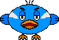

# Spider Scramble

**Backstory:**

Charlie is a spider that loves his home in the forest. He is a solitary spider in a woodland full of surprises. What does Charlie do all day? Why is he always exploring? Maybe to find a mate? No, Charlie has not time for that! Charlie is always hungry looking for something good to eat. Every day he sets up some webs near his home to catch some unsuspecting bugs. While he is out, Charlie loves to gather shiny coins. How did these get in the forest? Nobody knows. All Charlie knows is that they will look rather lovely in his Study, next to his collection of sea shells. We join Charlie as he sets out on a run to check those webs...

**Characters:**

| Charlie | Harold | Roxxy |
| :---:  | :---:  | :---:  |
| |  |  |

**Object of the Game:**

Try to collect as many "BUG" coins as you can to increase your score. Your score also increases the longer Charlie survives.  
You will encounter some obstacles along the way too. Watch out for that birb, Harold! He is a tricky one! You will have to jump over that pesky Roxxy as well.  
In a bind? Don't worry, those obstacles can be blasted for some extra points! Be careful though, you only have 5 shots. Eat more bugs caught in webs to get back some health and refill your shots!  
Challenge your friends to survive the longest, collect the most coins and get the highest score!
